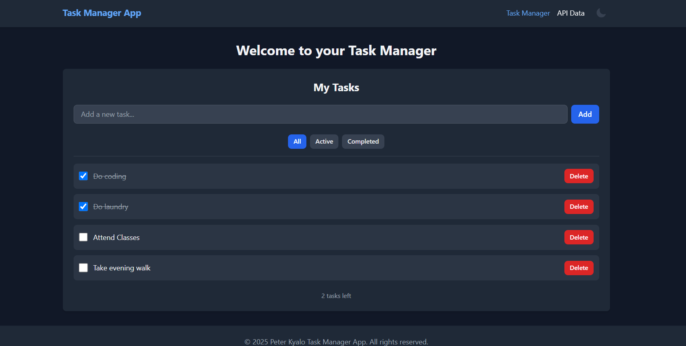

# PLP Week 3: React, JSX, and Tailwind CSS

This project is a responsive React application built for the Week 3 assignment. It demonstrates core React concepts including component architecture, state management with hooks, API integration, and modern styling with Tailwind CSS.

## Deployed Application

**Live URL:** [https://week-3-react-js-assignment-peterkya.vercel.app/]

## Screenshots of the App

### Task Manager




### API Data


## Features

- **Component-Based Architecture**: Reusable UI components like `Button`, `Card`, `Navbar`, and `Footer`.
- **State Management & Hooks**:
  - `useState` for local component state.
  - `useEffect` for handling side-effects like API calls.
  - `useContext` for global theme management.
  - Custom `useLocalStorage` hook for persisting tasks.
- **Task Manager**: A fully functional to-do list where users can add, complete, delete, and filter tasks.
- **API Integration**:
  - Fetches data from the [JSONPlaceholder](https://jsonplaceholder.typicode.com/) public API.
  - Displays data with clear loading and error states.
  - Implements a search filter for API results.
  - Includes pagination to navigate through the data.
- **Styling with Tailwind CSS**:
  - Fully responsive design for mobile, tablet, and desktop.
  - A theme switcher to toggle between light and dark modes.
  - Interactive elements with hover effects and transitions.
- **Routing**: Client-side routing implemented with `react-router-dom`.

## Project Structure

```
src/
├── components/     # Reusable UI components
├── context/        # React Context for global state (Theme)
├── hooks/          # Custom React hooks
├── layouts/        # Layout components (e.g., MainLayout with Navbar/Footer)
├── pages/          # Page components for different routes
├── App.jsx         # Main application component with routing
└── main.jsx        # Application entry point
```

## Setup and Installation

### Prerequisites

- [Node.js](https://nodejs.org/) (v18 or higher recommended)
- [npm](https://www.npmjs.com/) or [yarn](https://yarnpkg.com/)

### Installation Steps

1.  **Clone the repository:**

    ```bash
    git clone https://github.com/your-username/your-repo-name.git
    cd your-repo-name
    ```

2.  **Install dependencies:**

    ```bash
    npm install
    ```

3.  **Install additional dependencies for icons:**

    ```bash
    npm install @heroicons/react
    ```

4.  **Start the development server:**

    ```bash
    npm run dev
    ```

    The application will be available at `http://localhost:5173`.

### Building for Production

To create a production-ready build, run:

```bash
npm run build
```

This will create a `dist` folder with optimized static assets.
